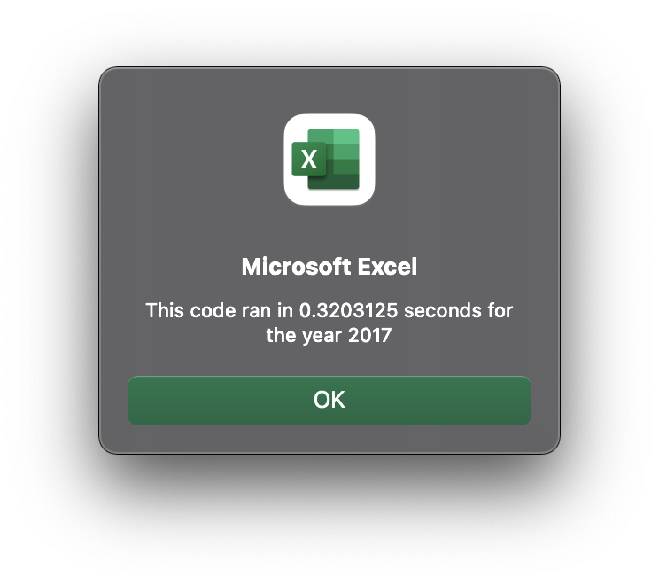
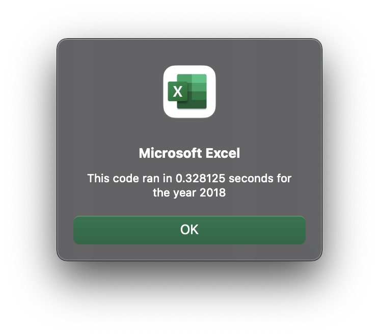
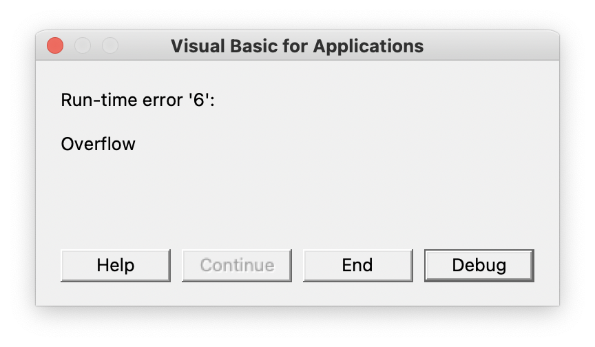

# Stock-Analysis

## Overview of Project
   This proctect was to first see how Steves parents stock Daqo was performing. We wanted to find the daily and yearly returns for it after we wrote the code it became noticable that we need to find different stocks for them to look in to. That is when we added code so we could analyze muliple stock for them. When Steve say how well that worked he wait us to see if we could do the whole stock market. This is were we had to use refactor to make the code more efficent so we could do better anaylsis.
 
 ## Results
   The reason we wanted to start looking in to more stocks was that Daqo did not have a postive return. When we start looking at more stocks it became clear that stocks did better in 2017 than they are in 2018. Out of the 12 stocks that were analysis only two had positive returns in 2018. 
  
 
 ### Execution Time
 When we ran the code for the 12 stocks in 2017 and 2018 the first time the speed were pretty close to each other. They staedy that way after multi times running the code.  The one thing we realized is the more times you run it the faster it gets. we our only talking about hundered of seconds. Now when we did the same thing for the whole stock market the time only slowed down by hunderedsth with alot more imputs. 

## Summary

### Advantages and Disadvantages
   When you are looking at refactoring code there is a lot of simialrities between that and the original VBA script. The big advantage of refactoring is the time it takes to go thourgh alot of data. You are able to write code to make it quick to see trends and dips when you are seeing a bigger sample. The big disadvantage that we found is that the code for the origanal is alot easier and smoother to get to work. When you are working with alot more data you are more likely to have to write and rewrite code. The thing that we kept running into was overflow error. What it comes down to is what are you trying to do!
   
   
### Advantages and Disadvantages and How they apply
   Like we were saying we think it matters on what you want. If you have already narrowed your choice down the disadvantages to refactoring play a big part. It is better to use the original. If you are just starting or trying to find a trend or flows in a big data set. It is alot better to work thourgh the bugs and error to get more info. That way you have all the info to make the best decision. In the end it is all what you are trying to get out of the analysis.
