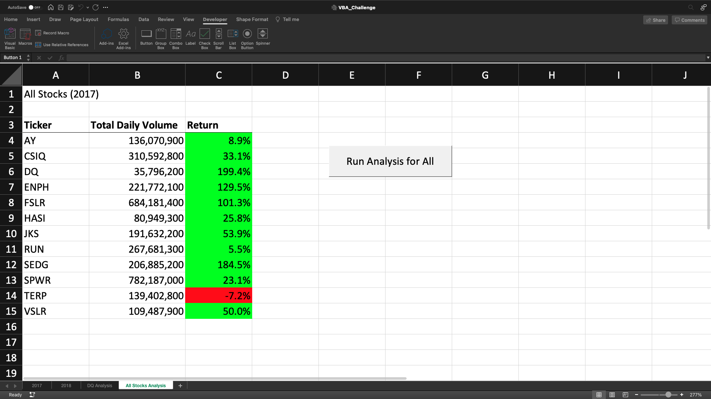
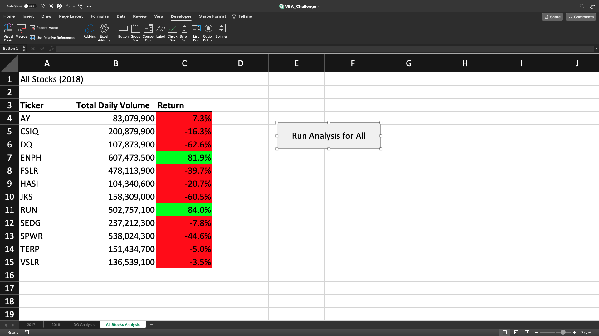

# Stock-Analysis

## Overview of Project
   This proctect was to first see how Steves parents stock Daqo was performing. We wanted to find the daily and yearly returns for it after we wrote the code it became noticable that we need to find different stocks for them to look in to. That is when we added code so we could analyze muliple stock for them. When Steve say how well that worked he wait us to see if we could do the whole stock market. This is were we had to use refactor to make the code more efficent so we could do better anaylsis.
 
 ## Results
   The reason we wanted to start looking in to more stocks was that Daqo did not have a postive return. When we start looking at more stocks it became clear that stocks did better in 2017 than they are in 2018. Out of the 12 stocks that were analysis only two had positive returns in 2018.
  
 
 ### Execution Time
 When we ran the code for the 12 stocks in 2017 and 2018 the first time the speed were pretty close to each other. They staedy that way after multi times running the code. The one thing we realized is the more times you run it the faster it gets. 

